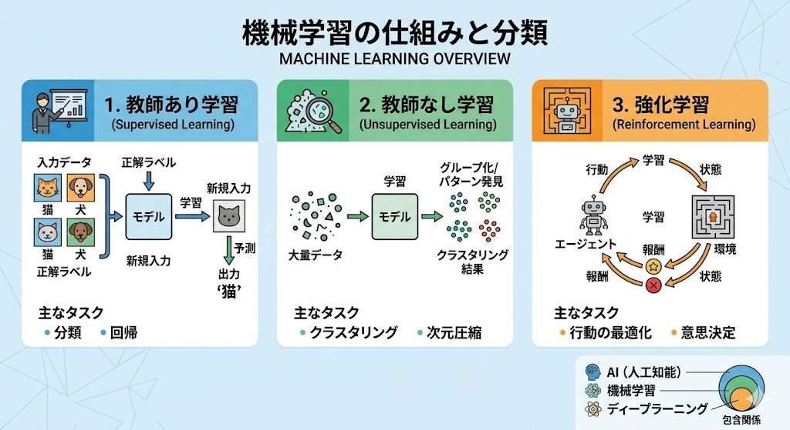

# 機械学習 オリエンテーション
## サンプルタイトル
サンプルです。

`aa`
```C
#include <studio.h>

int main(){
  printf("Hello world¥n);
  return 0;
}
```

- 数式1 : $w = \bm{w}^t\bm{x}+b$
- 数式2:
$$w = \bm{w}^t\bm{x}+b$$

- あああ
  - ああ
    - okok 
      - いいねこれ

